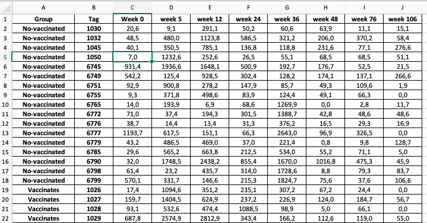

<style>
#TOC {
  color: black;
  font-familiy: Calibri;
  font-size: 14px;
  border-color: #708090; 
}
body {
   color: black;
   font-familiy: Calibri;
}

pre {
  color: black;
  background-color: #F8F8FF;
}
# header {
  color: #800000;
  font-familiy: Calibri;
  background-color: #F5F5F5;
  opacity: 0.8;
  font-size: 16px;
}
</style>

#### **Introducción**

#### **_Tranformación y manipulación de datos._**

La transformación y manipulación de datos es una de las actividades que más tiempo demanda durante un análisis exploratorio ya que implica tanto dar el formato adecuado para realizar los análisis estadísticos, como aplicar transformaciones sobre las variables de interés. Este proceso se lleva a cabo con el fin de generar un conjunto de datos limpio y diferente del set de datos original, adecuado para su *posterior* análisis.

La manipulación de datos se puede resumir, pero no limitar, a cinco operaciones básicas:

**1.-** **Transformar un conjunto de datos desordenado (messy) a ordenado (Tidy)**

Tres caracteristicas nos permiten reconocer si nuestros datos están ordenados o no para ser manipulados por R de forma natural y eficiente.

| **Tidy data (datos ordenados)**  |  **Messy data (desordenados)**  |
|:---:|:---:|
|  Cada columna es una variable |  Cualquier conjunto de datos que no cumple alguno de estos criterios |
|  Cada fila es una observación |   |
| Cada celda es un simple dato o valor  |   |


**2.-** **Extraer subconjuntos de datos** 

Ya sea por filas utilizando algún criterio o por columnas (variables) donde no es necesario considerar a todas las variables presentes en la base de datos original.

**3.-** **Transformar variables**

La transformación de datos implica realizar operaciones aritméticas o lógicas sobre las variables de interes. En general cuando una **variable es continua** realizamos operaciones **_aritméticas_** y cuando es **categórica** operaciones **_lógicas_**.

**4.-** **Resumir los datos**

Se puede resumir la información por variable calculando por ejemplo valores promedio, desviaciones estándar, valores mínimos o máximos.

**5.-** **Compactar o unir con otros conjuntos de datos** 

Es posible que en tiempos posteriores surjan nuevas bases de datos que pueden enriquecer nuestros análisis, es muy útil combinar/compactar dicha información de forma homogénea en una sola base de datos.

#### **_Visualización de datos._**

Como ya hemos mencionado, en la etapa de análisis exploratorio de datos es muy importante hacer representaciones gráficas o visualizar los datos, durante la etapa de manipulación esto nos permitirá:

* Detectar posibles valores atípicos u "outliers" en inglés.

* Identificar la posible distribución subyacente de la variable respuesta **(Y)**. 

* Analizar posibles relaciones/asociaciones entre la variable respuesta **(Y)** y alguna variable explicativa **(X)**.

* Sintetizar de forma gráfica la información relevante de los datos.

En esta guía continuaremos trabajando con librería **ggplot2**, que como ya hemos visto contiene la función **_ggplot()_** con la que se generan gráficos tanto visualmente informativos como de agradable aspecto. Pero además trabajaremos con varias funciones del paquete [dplyr](https://dplyr.tidyverse.org/), y algunas del paquete [tidyr](https://tidyr.tidyverse.org/). En conjunto estos paquetes son una herramientas muy poderosas de R para transformar y manipular datos de forma efectiva.

#### **Comandos para realizar gráficas avanzadas con ggplot2**

|  **Comandos** | **Función** |
|:-------------|:------------------|
| **ggplot():**| Comando base sobre el cual se realizan gráficas avanzadas. |
| **geom_point():** | Argumento que se adiciona a la función ggplot() para generar diagramas de dispersión. |
| **geom_line():** | Argumento que se adiciona a la función ggplot() para generar diagramas de líneas. |
| **geom_col():** | Argumento que se adiciona a la función ggplot() para generar diagramas de barras. |
| **geom_histogram():** | Argumento que se adiciona a la función ggplot() para generar histogramas. | 
| **geom_boxplot():** | Argumento que se adiciona a la función ggplot() para generar gráficos de cajas y bigotes. |   
| **facet_wrap(~ variable):** | Argumento que se adiciona a la función ggplot() para que realice tantos gráficos según los niveles que tenga la variable. |

#### **Comandos para manipular datos con dplyr**

|  **Comandos** | **Función**      |
|:-------------|:------------------|
| **%>%** | Este comando se llama **_pipe_** o "tubería", es una herramienta para la composición de funciones, lo que facilita la resolución de problemas grandes partiéndolos en pedazos pequeños. |
| **filter()** | Filtra los datos por algún criterio establecido por el analista. |
| **arrange()** | Ordena la base de datos según una variable de forma ascendente o descendente. |
| **mutate()** | Cambia el contenido de una variable o genera variables derivadas a partir de variables existentes en el conjunto de datos. |
| **summarize()** | Resume la información de la/s variable/s en un solo dato. Algunas funciones que se pueden usar para resumir la información son: **_mean_** *para calcular el promedio por variable*, **_sum_** *para sumar las observaciones de una variable*, **_median_** *para calcular la mediana por variable*,**_min_** *para encontrar el valor mínimo por variable* y **_max_** *para encontrar el valor máximo por variable*.|
| **group_by** | Agrupa las observaciones (filas de la base de datos) por algún criterio establecido por el analista.|

#### **Objetivos de aprendizaje**

Los objetivos de aprendizaje de esta guía son:

**1**. - Realizar un análisis exploratorio de datos.  

**2**. - Realizar gráficas avanzadas con **ggplot2**.

**3**- - Realizar transformación y manipulación de datos con **tidyr** y **dplyr**.

## **Ejercicios**

### **Ejercicio 1.** Elaborar un Script de R (Archivo .R)

Elabore un archivo o file con extensión **.R** usando la barra de herramientas de **Rstudio**. Selecciona **File > New file > R script**. Utilice el siguiente ejemplo para completar la información de **metadatos** del script.

    # ----------------------------------------------------------  
    # Clase 07 - Técnicas avanzadas para realizar EDA.   
    # Su nombre. 
    # Fecha de hoy. 
    # Diplomado R para Biociencias. 
    # ----------------------------------------------------------  

Luego, guarde inmediatamente su script como **script_EDA_nombre_apellido.R**.

### **Ejercicio 2.** **Configuración del Script**

```{r setup, include=FALSE, message=FALSE}
knitr::opts_chunk$set(echo = FALSE)
```

Cargue los paquetes **readxl**, **stats**,**dplyr**, **tidyr**, **ggplot2** y  **forcats** usando la función **_library()_**.

```{r, include=FALSE, message=FALSE}
library(readxl)
library(stats)
library(dplyr)
library(tidyr)
library(ggplot2)
library(forcats) # To reorder levels in a factor
```

### **Ejercicio 3.** **Importar datos y transformar datos a R en formato TIDY** 

En el siguiente ejercicio deberá realizar la manipulación de un pequeño conjunto de datos desordenado (messy) de respuesta a vacunación en bovinos obtenido desde el trabajo de ([Parlane et al, 2014](doi:10.1371/journal.pone.106519). En cual se describe en la tabla 1. 

**a)** **Explorar y ordenar archivo excel.**  
Explore el archivo excel y observe que los datos no están adecuadamente ordenados para ser importados a R. Descargue el archivo excel a su computador y edite para eliminar la leyenda de la tabla 1 y para que los datos estén ubicados en la celda A1 como se muestra en la siguiente figura.

```{r, echo=FALSE, out.width = '90%' }

```

**b)** **Importar y preparar datos ordenados Tidy**
Cree un objeto llamado **messy_vacunas** e importe dentro de este objeto el set de datos **IFN_response.xlsx**. Use la función **_read_excel()_** de la librería **readxl**. Note que las variables Group y Tag están adecuadamente ordenados para analizar con R, pero no así las variables week 0 a week 106 pues todas ellas representan la respuesta de INF a la vacunación. Use la función **gather()** del paquete tidyr para ordenar las columnas 3-10 a formato tidy creando un nuevo objeto llamado "tidy_vacunas" con las nuevas variables "Week" e "IFN response". 

```{r, echo=TRUE}
messy_vacunas <- read_excel("IFN_response.xlsx", sheet=3)
tidy_vacunas <- messy_vacunas %>% gather("Week","IFN response",3:10)
```

El objeto tidy debería visualizarse como la siguiente tabla, **head(tidy_vacunas)**.

```{r}
head(tidy_vacunas)
```

### **Ejercicio 4.** **Explorar y resumir datos** 

**a)** **Explorar y transformar variables**
Explore el set de datos tidy_vacunas usando la función **str()** y luego transforme la variable **Group**, **Tag** a factor usando **as.factor()** y **Week** a número usando **as.numeric**. Use **summary** para visualizar que las variables fueron trasformadas adecuadamente a factor. 

```{r}
str(tidy_vacunas)
tidy_vacunas$Tag <- as.factor(tidy_vacunas$Tag)
tidy_vacunas$Group <- as.factor(tidy_vacunas$Group)
tidy_vacunas$Week <- as.numeric(tidy_vacunas$Week)
summary(tidy_vacunas)
```

Finalmente use la función **table()** para evaluar si los datos están o no balanceados respecto de los tratamientos **Group** y **Week**.

```{r}
table(tidy_vacunas$Group, tidy_vacunas$Week)
```


**b)** **Filtrar datos por un criterio de clasificación** 

Del conjunto de datos **tidy_vacunas** seleccione solo la información del grupo **Vaccinated**. Para ello combine una tubería **%>%** con la función **_filter()_**, dentro de filter use el argumento *Group == Vaccinated*.

```{r, echo=TRUE}
tidy_vacunas %>%
  filter(Group == "Vaccinated")
```

**c)** **Filtrar datos por dos criterios de clasificación** 

Del set de datos **tidy_vacunas** seleccione solo los datos del Grupo **Vaccinated** y de la semana **week 24** simultaneamente. Para ello combine una tubería **%>%** con la función **_filter()_**. Dentro de filter use el argumento *Group == "Vaccinated"* y *Week == "24"*.

```{r}
tidy_vacunas %>%
  filter(Group == "Vaccinated", Week == "24")
```

**d)** **Calcular medidas resumen** 

Del conjunto de datos **tidy_vacunas** seleccione ahora el grupo **No-vaccinated** usando la función **_filter()_**. Combine con una nueva tubería y usando la función **_summarize()_** calcule la media de la variable **IFN response** como **mean(`IFN response`)**. Note que la variable en algunos casos está entre **""** y en otros entre **``**. 

```{r}
tidy_vacunas %>%
  filter(Group == "Vaccinated")%>%
  summarize(mean(`IFN response`))
```

Una de las grandes ventajas de la función **_summarize()_** es que puede calcular varias medidas de resumen simultáneamente. Del conjunto de datos **tidy_vacunas** seleccione el grupo **No-vaccinated** y calcule para la variable **IFN response** el número de datos **n()**, el promedio **mean()**, la mediana **median()**, el valor mínimo **min()**, máximo **max()** y la desviación estándar **sd()**. Note que el conteo de n() no requiere indicar la variable respuesta.

```{r, echo=TRUE}
tidy_vacunas %>%
  filter(Group == "Vaccinated")%>%
  summarize(n(), mean(`IFN response`), median(`IFN response`), min(`IFN response`), max(`IFN response`), sd(`IFN response`))
```

Ahora, cambie los títulos de cada columna agregando al código anterior un nuevo nombre entre comillas. Siga este ejemplo para la primera columna **summarize("N" = n()** y complete para las columnas restantes.

```{r, echo=TRUE}
tidy_vacunas %>%
  filter(Group == "Vaccinated")%>%
  summarize("N"=n(), "Mean"=mean(`IFN response`), "Median"= median(`IFN response`), "Minimun"=min(`IFN response`), "Maximun"=max(`IFN response`), "Standard deviation"=sd(`IFN response`))
```

Finalmente, para publicar una tabla resumen de forma profesional debemos crear un objeto llamado **Table**, almacenar nuestra última tabla resumen en el y luego imprimirla con el comando **knitr::kable()** de la librería **knitr**. Incluya dentro de **knitr::kable()** una leyenda de la tabla con el argumento *caption=""*. Investigue el uso de **kable** para realizar este ejercicio.


```{r, echo=TRUE}
Table <- tidy_vacunas %>%
  filter(Group == "Vaccinated")%>%
  summarize("N"=n(), "Mean"=mean(`IFN response`), "Median"= median(`IFN response`), "Minimun"=min(`IFN response`), "Maximun"=max(`IFN response`), "Standard deviation"=sd(`IFN response`))

knitr::kable(Table, caption = "Tabla 1. Resumen de respuesta de IFN en animales no vacunados.")

```


### **Ejercicio 5.** **Graficar y exportar figuras** 

**a)** **Graficar diagramas de barras con ggplot()** 

Con el conjunto de datos **tidy_vacunas** elabore un gráfico de barras con la función **ggplot()** + el argumento **geom_bar()**. Use como variable de clasificación (x) **Group**. 

```{r, echo=TRUE}
ggplot(tidy_vacunas, aes(x= Group))+
   geom_bar()
```

En la gráfica anterior, coloree la variable grupo usando el argumento **fill=Group** dentro de *aes*.
```{r}
 ggplot(tidy_vacunas, aes(x= Group, fill=Group))+
   geom_bar()
```

En la gráfica anterior modifique la leyenda del eje **x** con el comando **labs()**. Nombre el eje x como **""** para eliminar la leyende del eje e incluya un pie de figura "Fuente: Parlane et al, 2014" con el argumento **captions**.

```{r}
 ggplot(tidy_vacunas, aes(x= Group, fill=Group))+
   geom_bar()+
  labs(x= "", caption = "Fuente: Parlane et al, 2014")
```

Para visualizar los datos de cada semana incluya a la gráfica anterior una nueva capa con el comando **facet_wrap(~ Week)**.

```{r, echo=TRUE, fig.width= 8, fig.align='center'}
 ggplot(tidy_vacunas, aes(x= Group, fill=Group))+
   geom_bar()+
  labs(x= "", caption = "Fuente: Parlane et al, 2014")+
   facet_wrap(~ Week)
```

Finalmente exportaremos la gráfica en formato de alta calidad usando los comandos **tiff()** del paquete **{grDevices}** antes del código que crea la gráfica, y el comando **dev.off()** después del comando que crea la gráfica. Use el siguiente ejemplo, pero con sus propios comandos de creación de la gráfica.

      tiff("IFN Gene expression.tiff", units="in", width=8, height=4, res=300, compression = 'lzw')
      ggplot())+
      geom_bar()+
      labs()+
      facet_wrap()
      dev.off()

```{r}
tiff("IFN Gene expression.tiff", units="in", width=8, height=4, res=300, compression = 'lzw')
ggplot(tidy_vacunas, aes(x= Group, fill=Group))+
geom_bar()+
labs(x= "", caption = "Fuente: Parlane et al, 2014")+
facet_wrap(~ Week)
dev.off()

```


### **Ejercicio 6.** **Graficar líneas con barras de error** 

La función **group_by()** es muy útil para resumir información estadística agrupando por un conjunto de filas, por ejemplo, para agrupar y resumir información estadística de los diferentes niveles de un factor. Esto es usualmente usado como paso previo a realizar gráficas con medidas resumen como el promedio, la mediana y la desviación o el error estándar.

**a)** Use dos tuberías, primero para seleccionar Grupo y Semana desde el objeto **tidy_vacunas** usando la función **group_by()** y luego para calcular **n()**, el promedio **mean()** y la desviación estándar **sd()** de la variable **IFN response** usando **summarize()**.

```{r, echo=TRUE}
tidy_vacunas %>%  group_by(Group, Week) %>% summarize(n=n(), mean = mean(`IFN response`), sd=sd(`IFN response`))

```

**b)** Cree un objeto llamado **tidy_plot** y almacene en el las medidas resumen que calculó anteriormente. Use el siguiente comando **head(tidy_plot, 12)**.

```{r, echo=TRUE}
tidy_plot <- tidy_vacunas %>%  group_by(Group, Week) %>% summarize(n=n(), mean = mean(`IFN response`), sd=sd(`IFN response`))
head(tidy_plot, 12)
```

**c)** Ahora crearemos una variable derivada denominada **error**, en la cual calcularemos el error estándar con el comando **mutate()** y dentro de este la fórmula **error = sd/sqrt(n)**.

```{r, echo=TRUE}
tidy_plot <- tidy_plot %>%
  mutate(error = sd/sqrt(n))
head(tidy_plot)
```

**c)** Finalmente crearemos una gráfica de líneas con barras de error. 

Primero crearemos la primera capa con el comando **ggplot()**, incluya el argumento **aes** y defina como argumentos x= Week, y=mean, y para colorear los argumentos color=Group y group=Group.
```{r}
tidy_plot %>%
  ggplot(aes(x=Week, y= mean, color=Group, group=Group))
```

Ahora agregaremos la segunda capa con el comando **geom_line()**.

```{r}
tidy_plot %>%
  ggplot(aes(x=Week, y= mean, color=Group, group=Group)) +
  geom_line()
```

La tercera capa serán los puntos con el comando **geom_point()**.

```{r}
tidy_plot %>%
  ggplot(aes(x=Week, y= mean, color=Group, group=Group)) +
  geom_line()+
  geom_point()
```

La cuarta capa serán los errores estándar con el comando **geom_errorbar()**. Investigue el uso del comando **geom_errorbar()** en el siguiente [enlace](http://www.sthda.com/english/wiki/ggplot2-error-bars-quick-start-guide-r-software-and-data-visualization)

```{r, echo=TRUE}
plot_1 <- tidy_plot %>%
  ggplot(aes(x=Week, y= mean, color=Group, group=Group)) +
  geom_line()+
  geom_point()+
  geom_errorbar(aes(ymin=mean-error, ymax=mean+error), width=.2,
                 position=position_dodge(0.05))
plot_1
```

Finalmente, exportaremos la gráfica en formato **jpeg** con el comando **ggsave()** del paquete **ggplot2**. Use el siguiente ejemplo. Note que ggsave almacena siempre el último gráfico creado.

    ggsave("Plot.jpeg", width = 8, device="jpeg")

```{r}
ggsave("Plot_1.jpeg", width =8, device="jpeg")
```

