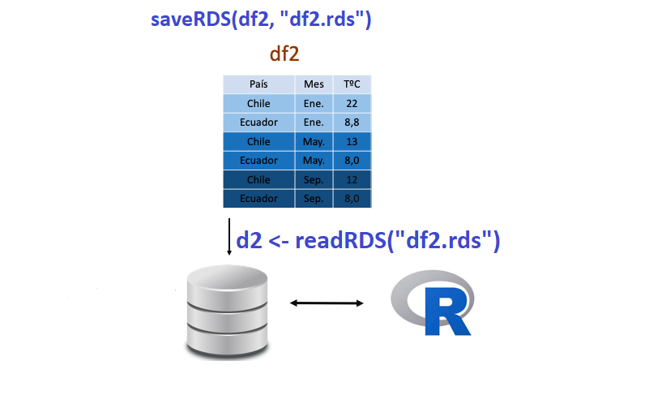
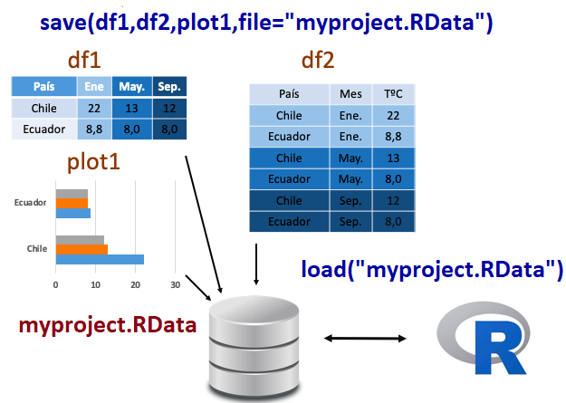

```{r setup, include=FALSE, comment=TRUE}
knitr::opts_chunk$set(echo = FALSE)
```

## **PLAN DE CLASE**

**1).** **Introducción**

- Paradigmas para editar reportes: WYSIWYG v/s WYSIWYM

- ¿Qué es Rmarkdown y para que sirve?

- ¿Qués son los archivos .RData y .rsd?

- ¿Cómo generar/cargar archivos tipo .RData y .rds?


**2).** **Práctica con R y Rstudio cloud**

- Escribir un código de programación con Rmarkdown.

- Elaborar reportes dinámicos con Rmarkdown.

- Alcebar un proyecto en formato .Rdata


## FORMAS DE CREAR REPORTES: WYSIWYG

- **What You See Is What You Get**  
Word, Power Point, pdf, otros.

```{r, echo=FALSE, out.width = '80%', fig.align='center'}
knitr::include_graphics("WYSIWYG.png")
```

[@2022. The Free On-line Dictionary of Computing](https://encyclopedia2.thefreedictionary.com/What-you-see-is-what-you-get)

## FORMAS DE CREAR REPORTES: WYSIWYM

- **What You See Is What You Mean (WYSIWYM)**.  
HTML, Latex, Markdown, Rmarkdown.

```{r, echo=FALSE, out.width = '80%', fig.align='center'}
knitr::include_graphics("HTML_Example_Code_new.png")
```

## **¿QUÉ ES MARKDOWN?**

- Markdown es un lenguaje de marcado ligero creado por **John Gruber** que trata de conseguir la máxima legibilidad y facilidad de publicación tanto en su forma de entrada como de salida.

```{r, echo=FALSE, out.width = '50%', fig.align='center'}
knitr::include_graphics("Markdown.png")
```

## **¿QUÉ ES R MARKDOWN?**

- Rmarkdown es un procesador de texto que permite la creación de reportes de alta calidad integrando texto ligero con códigos de R. 

```{r, echo=FALSE, out.width = '100%', fig.align='center'}
knitr::include_graphics("Rmarkdown.png")
```

## **TIPOS DE REPORTES CON RMARKDOWN**

```{r, echo=FALSE, out.width = '100%', fig.align='center'}
knitr::include_graphics("Reportes.png")
``` 

## **VENTAJAS DE USAR RMARKDOWN?**

- Es un software libre y de código abierto, por lo que podemos usarlo sin necesidad de comprar una licencia.

- Permite trabajar bajo el paradigma de la investigación reproducible (texto sin formato).

- Permite crear reportes, documentos, presentaciones y libros de alta calidad (plantillas disponibles).

- Uno de los mejores sistemas para crear y automatizar reportes. 

## **¿CÓMO FUNCIONA R MARKDOWN? 1 **

- Los archivos tienen extensión .Rmd

```{r, echo=FALSE, out.width = '100%', fig.align='center'}
knitr::include_graphics("Rmarkdown1.png")
```


## **¿CÓMO FUNCIONA R MARKDOWN? 2**

```{r, echo=FALSE, out.width = '100%', fig.align='center'}
knitr::include_graphics("Rmarkdown2.png")
```


## **ARCHIVOS .rds (Serialized R objects)**

- Tipo de archivo propio de R que permite comprimir un objeto (df) manteniendo su estructura (ej. factor o numeric).
- Para exportar un archivo .rds se usa la función **saveRDS()**
- Para leer o importar archivos .rds se usa la función **readRDS()**
                        
```{r, echo=FALSE, out.width = '80%', fig.align='center'}

```


## **ARCHIVOS .RData**

- Tipo de archivo de R que permite guardar los objetos creados en el espacio de trabajo o workspace. Son muy útiles para trabajar en proyectos donde existen muchos objetos. Guarda con **save()** o **save.image()**. 

- Para cargar o importar un archivo .RData debes usar la función **load()**.

```{r, echo=FALSE, out.width = '60%', fig.align='center'}

``` 
 
##  **RESUMEN DE LA CLASE**

- Paradigmas: WYSIWYG v/s WYSIWYM.

- Que es Rmarkdown y como funciona.

- Ventajas de elaborar reportes dinámicos con Rmarkdown.

- Escribir códigos de programación con Rmarkdown.

- Elaborar diferentes reportes dinámicos (word, pdf, html).

- Guardar y cargar archivos .RData y .rds.

