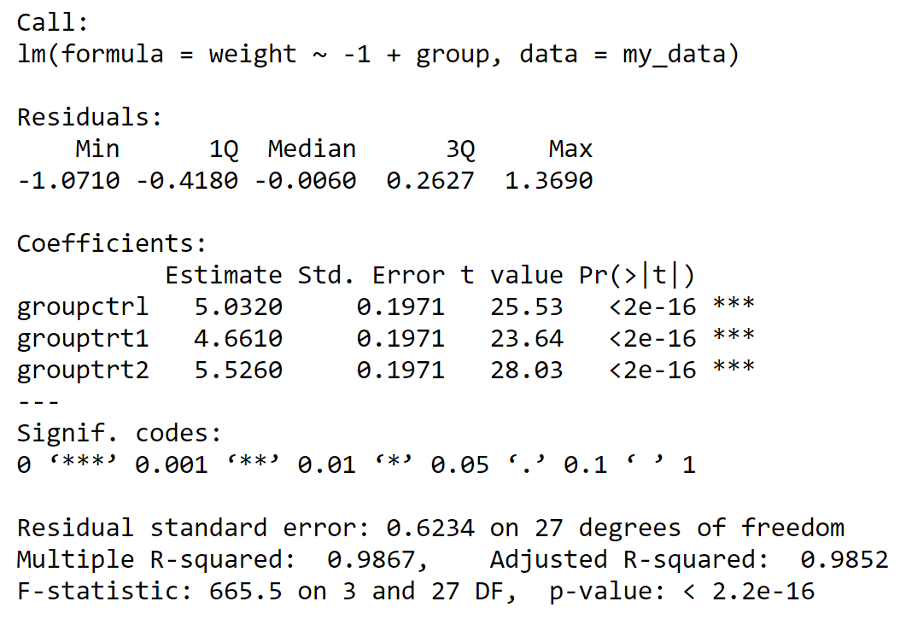
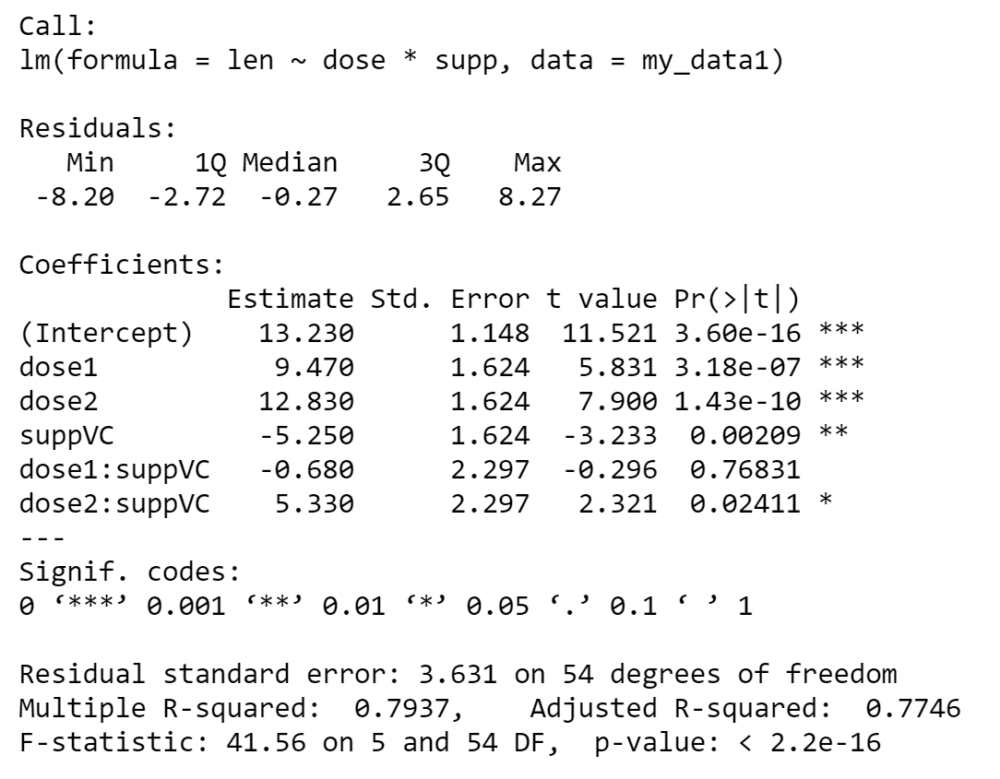

```{r setup, include=FALSE}
knitr::opts_chunk$set(echo = FALSE)
library(ggplot2)
library(UsingR)
library(dplyr)
library(knitr)
library(broom)

My_Theme = theme(
  axis.title.x = element_text(size = 20),
  axis.text.x = element_text(size = 20),
  axis.title.y = element_text(size = 20),
  axis.text.y = element_text(size = 20))
```

# PLAN DE LA CLASE
**1.- Introducción**
    
- ¿Qué es un análisis de varianza?.   
- Anova como un modelo lineal.
- Hipótesis y supuestos.
- Interpretar resultados de análisis de varianza con R.

**2.- Práctica con R y Rstudio cloud**

- Realizar pruebas de hipótesis: Anova y posteriores.
- Realizar gráficas avanzadas con ggplot2. 
- Elaborar reporte dinámico en formato html.  


# ANOVA

**¿Qué es un análisis de varianza?**

Herramienta básica para analizar el efecto de uno o más factores (cada uno con dos o más niveles) en un experimento.

```{r, echo=FALSE, out.width = '100%' }
knitr::include_graphics("anova.png")
```

# PROBLEMA DE LAS COMPARACIONES MÚLTIPLES

**¿Por qué preferir anova y no múltiples t-test?**  
Porque con una t-test normal al aumentar el número de comparaciones múltiples se incrementa la tasa de error tipo I.

```{r, echo=FALSE, out.width = '60%',fig.align='center'}
knitr::include_graphics("problema.png")
```

Fuente[1]: [1]:doi:10.21037/jtd.2017.05.34 

# ANOVA COMO UN MODELO LINEAL

**¿Qué es un modelo lineal?**  
Modelo estadístico que define una relación matemática lineal entre variables de interés.

**Modelo lineal para ANOVA de una vía**  
$y$ ~ $\mu$ + $\alpha$ + $\epsilon$   

**Modelo lineal para ANOVA de dos vías**  
$y$ ~ $\mu$ + $\alpha$ + $\beta$ + $\epsilon$     

**Modelo lineal para ANOVA de dos vías con interacción**  
$y$ ~ $\mu$ + $\alpha$ + $\beta$ + $\alpha$*$\beta$ + $\epsilon$

# HIPÓTESIS EN UNA ANOVA

**Hipótesis factor 1**  
**H~0~** : $\alpha_{1.1}$ = $\alpha_{1.2}$ = $\alpha_{1.3}$ 

**Hipótesis factor 2**  
**H~0~** : $\beta_{2.1}$ = $\beta_{2.2}$ = $\beta_{2.3}$  

**Hipótesis interacción**  
**H~0~** : $\alpha$*$\beta$ = 0

**Hipótesis Alternativa**  
**H~A~** : No todas las medias son iguales

# ANOVA PARA COMPARAR MEDIAS

**¿Por qué se llama ANOVA si se comparan medias?**  
Por que el estadístico **F** es un cociente de varianzas.     

**F** = $\frac{\sigma^2_{entre grupos}}{\sigma^2_{dentro grupos}}$

Mientras mayor es el estadístico **F**, más es la diferencia de medias entre grupos.  

```{r, echo=FALSE, out.width = '100%' }
knitr::include_graphics("varianza-f.png")
```

# SUPUESTOS DE UNA ANOVA

1) Independencia de las observaciones.
 
2) Normalidad.
 
3) Homocedasticidad: homogeneidad de las varianzas.

# TEST POSTERIORES (PRUEBAS A POSTERIORI)

**¿Para qué sirven?**

Para identificar que pares de niveles de uno o más factores son significativamente distintos entre sí. 

**¿Cuando usarlos?**

Sólo cuando se rechaza **H~0~** del ANOVA. 

**Tukey test**  
Es uno de los más usados, similar al *t-test*, pero corrige la tasa de error por el número de comparaciones.

# ESTUDIO DE CASO: CRECIMIENTO DE PLANTAS

- PlantGrowth {datasets}

```{r, out.width = '80%'}
my_data <- PlantGrowth
my_data%>% 
  ggplot(aes(x=group,y=weight,fill=group))+
      geom_boxplot()+
     theme(legend.position="none")+
     labs(x="Group",y="Dried weight")+My_Theme

```

# ANOVA A UNA VÍA (UN CRÍTERIO DE CLASIFICACIÓN)

```{r, echo=TRUE}
res.aov <- lm(weight ~ group, data = my_data)
anova(res.aov)
```

# ANOVA COMO MODELO LINEAL

**summary(res.aov)** 

```{r, echo=F, out.width = '90%'}
# summary(res.aov)
knitr::include_graphics("anova_lm.png")
```


# MODELO LINEAL SIN INTERCEPTO

**res.aov <- lm(weight ~ -1 + group, data = my_data)**
**summary(res.aov)**

```{r, echo=FALSE, out.width = '90%' }
# res.aov <- lm(weight ~ -1 + group, data = my_data)
# summary(res.aov)

```


# COMPARACIONES MÚLTIPLES

```{r , echo=TRUE}
fit_anova <- aov(res.aov)
tk <- TukeyHSD(fit_anova)
```

```{r}
tidy(tk) %>% kable(caption = "Prueba de Tukey.", digits=2,
col.names=c("Trat.","Contraste", "H0",
            "Diferencia", "IC-bajo","IC-alto",
            "p-ajustado"))
```

# ESTUDIO DE CASO: GUINEA PIGS

- ToothGrowth {datasets}

```{r, out.width = '80%'}
my_data1 <- ToothGrowth
# table(my_data1$supp, my_data1$dose)

my_data1$dose <- as.factor(my_data1$dose)
my_data1%>% 
  ggplot(aes(x=dose,y=len,fill=supp))+
      geom_boxplot()+
     labs(x="Dose vitamin c",y="Length of odontoblasts")+My_Theme

```

OJ: Orange juice - VC: Vitamin C

# ANOVA DOS VIAS CON INTERACCIÓN

**res.aov2 <- lm(len ~ dose * supp, data = my_data1)**  
**anova(res.aov2)**

```{r, echo=F, out.width = '100%'}
# res.aov2 <- lm(len ~ dose * supp,
#                  data = my_data1)
# anova(res.aov2)
knitr::include_graphics("anova_lm2.png")
```

# ANOVA COMO MODELO LINEAL
**summary(res.aov)** 
```{r, echo=F, out.width = '80%'}
# summary(res.aov2)

```


# PRÁCTICA ANÁLISIS DE DATOS

- El trabajo práctico se realiza en Rstudio.cloud. 

**Guía 14 Anova y posteriores**


# RESUMEN DE LA CLASE

- **Elaborar hipótesis de anova**

- **Realizar análisis de varianza**
    * 1 factor.  
    * 2 factores y con interacción.
    * pruebas *a posteriori*
    
- **Realizar gráficas avanzadas con ggplot2**