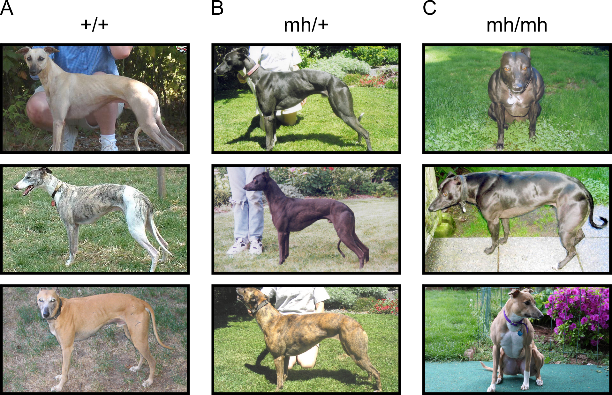

<style>
#TOC {
  color: black;
  font-familiy: Calibri;
  font-size: 14px;
  border-color: #708090; 
}
body {
   color: black;
   font-familiy: Calibri;
}

pre {
  color: black;
  background-color: #F8F8FF;
}
# header {
  color: #800000;
  font-familiy: Calibri;
  background-color: #F5F5F5;
  opacity: 0.8;
  font-size: 16px;
}
</style>

### MODELOS LINEALES

Los modelos lineales son ampliamente utilizados en acuicultura para explicar, modelar o predecir la relación lineal de una variable respuesta $Y$ con una o más variables predictoras $X_1,…,X_p$. 

$$Y_{i} = \beta_{0} + \beta_{1} X_{i1} + \beta_{2} \beta_{i2} + ... + \beta_{p} X_{ip} + \epsilon_{i}$$

Supuestos: $Y_i$  se distribuye **normalmente**

* Si **p = 1**, el modelo es una regresión **_lineal simple_**.

* Si **p > 1**, el modelo es una regresión **_lineal múltiple_**.

* Si **p > 1** y alguna variable predictora es **categórica**, el modelo se denomina **_ANCOVA_**.   

### PRUEBA DE HIPÓTESIS: COEFICIENTE DE REGRESIÓN E INTERCEPTO 

**_Prueba de hipótesis del coeficiente de regresión y el intercepto_**

La hipótesis nula en ambos casos es que el coeficiente del intercepto ($β_0$) y de la pendiente ($β_1$) son iguales a 0.

$H_0:β_0 = 0$ y $H_0:β_1 = 0$

### PREDICCIÓN A PARTIR DEL MODELO DE REGRESIÓN LINEAL SIMPLE

El Coeficiente de determinación (**_R²_**) se calcula como el **cuadrado del coeficiente de correlación de pearson**. Este nos indica que tan buena es la predicción que el modelo hace de los datos.

El R cuadrado ajustado (**_R² ajustado_**) nos dice qué porcentaje de la variación de la variable dependiente es explicado por la o las variables independientes de manera conjunta. En un modelo de regresión lineal, el **R² ajustado** es una medida de bondad que considera el número de variables existentes en el modelo.

$$R^2_{ajust} =1-(1-R^2)\frac{n-1}{n-p-1}$$

donde: 

$n$ = tamaño de la muestra

$p$ = cantidad de variables predictoras en el modelo

**_Prueba de hipótesis del modelo completo_**

La hipótesis nula es si los coeficientes son iguales a 0.

$H_0:β_j = 0$ ; $j = 1, 2,...,k$

#### **Objetivos de aprendizaje**

Los objetivos de aprendizaje de esta guía son:

**1**. - Realizar análisis de datos usando modelos lineales.

**2**. - Realizar gráficas avanzadas con ggplot2. 

**3**. - Elaborar un reporte dinámico en formato html con **[Rmarkdown](https://rmarkdown.rstudio.com/)**.

#### EJERCICIOS

## ESTUDIO DE CASO: MUTACIÓN GEN MIOSTATINA

En vertebrados, la miostatina (MSTN) actua como es un represor del crecimiento muscular. Muchos trabajos han descrito que mutacioones en ese gen producen un fenotipo llamado de doble músculo caracterizado por un crecimiento exacerbado del músculo esquelético. En este ejercicio trabajaremos con un set de datos simulado de  perros de carrera que poseen este distintivo fenotipo [Adaptado de Mosher et al. 2007](https://doi.org/10.1371/journal.pgen.0030079)

```{r, echo=FALSE, out.width = '80%', fig.cap="Figura 1: Comparación de animales con diferentes genotipos del gen Miostatina: (A) +/+; (B) 1 mutante con alelo cys → stop (mh/+); (C) Dos copias de la mutación cys → stop (mh/mh)."}

```

La variable respuesta se denomina **mass-to-height ratio** y se expresa en Kg/cm. Para este set de datos existen dos variables predictoras que se deberán analizar: 1) **Geno**: que corresponde al genotipo de los animales; 2) **Sex**: que corresponde al sexo. 

La variable **Geno** tiene 3 niveles denominados **0, 1 y 2** equivalentes a los genotipos **+/+, +/mh y mh/mh** donde 0, 1 y 2 representan el número de alelos **mh**. Esta forma numérica de representar los genotipos es conveniente para analizar la variable **Geno** como una variable cuantitativa discreta **0, 1 y 2** o como un factor (ej. **factor(Geno)**) según sea nuestro interés. La variable **Sex** tiene dos niveles **male y female**.

### **Ejercicio 1.** Elaborar y configurar Reporte en formato .Rmd

Elabore un documento .Rmd y configure su reporte para exportar en .html. Instale los paquetes **readxl**, **ggplot2**, **dplyr** y **multcomp** para el análisis de los datos. 

```{r setup, include=TRUE, warning=FALSE,message=FALSE}
knitr::opts_chunk$set(echo = TRUE)
library(readxl)
library(ggplot2)
library(dplyr)
library(multcomp)
```

Ejecute cada uno de los siguientes ejercicios en uno o más bloques de códigos diferentes. Sea ordenado y documente su reporte adecuadamente.

### **Ejercicio 2.** Exploratorio set de datos snp.data

Importe el set de datos **myostatin.deletion.data.xlsx** y transforme solo la variable **Sex** a factor, luego realice un análisis exploratorio de datos. 

Incluya: 

**a).** Resumen estadístico de todas las variables.

```{r, warning=FALSE, message=FALSE}

snp.data <- read_excel("myostatin.deletion.data.xlsx")

snp.data$Sex <- as.factor(snp.data$Sex)
summary(snp.data)

```


**b).** Tabla de frecuencia combinada **Geno** por **Sex**, esto es importante para ver si los datos son o no balanceados.

```{r, warning=FALSE, message=FALSE}

table(snp.data$Sex, snp.data$Geno)

tapply(snp.data$`mass-to-height ratio`, factor(snp.data$Geno), mean)

tapply(snp.data$`mass-to-height ratio`, factor(snp.data$Sex), mean)
```


**c).** Histograma de la variable respuesta **mass-to-height ratio**.


```{r, warning=FALSE, message=FALSE}

ggplot(snp.data, aes(x=`mass-to-height ratio`))+
  geom_histogram(color="darkblue", fill="lightblue", bins = 12)

```

### **Ejercicio 3.** Regresión lineal simple.

**a).** Realice una gráfica de dispersión (geom_point) de **weight** en función de **Geno**, incluya el comando **geom_smooth(method=lm)** para agregar la línea de regresión a la gráfica.

```{r warning=FALSE, message=FALSE}

p <- ggplot(snp.data, aes(x = Geno, y = `mass-to-height ratio`))
p + geom_point() + xlab("Reference allele count") + geom_smooth(method=lm)

```

**b).** Realice un análisis de regresión lineal para investigar la asociación entre **weight** y **Geno** usando las funciones **lm()**, **summary()**. Interprete los resultados del modelo lineal y responda las siguientes preguntas. ¿Qué representa el estimador de Geno y del intercepto?. ¿La pendiente es significativamente distinta de cero?. ¿Y el intercepto?

```{r warning=FALSE, message=FALSE}

lm.geno <- lm(`mass-to-height ratio` ~ Geno, data = snp.data)
summary(lm.geno)

```

**c).** Realice la predicción de la media poblacional de **weight** para los genotipos AA, AB y BB y la predicción del peso **weight** de tres nuevos individuos con genotipo AA, AB y BB. ¿Qué tan buena son las predicciones obtenidas? Analice el R² ajustado y los intervalos de confianza.


```{r warning=FALSE, message=FALSE}

predict.lm(lm.geno, newdata=data.frame(Geno=c(0,1,2)), interval="confidence")

predict.lm(lm.geno, newdata=data.frame(Geno=c(0,1,2)), interval="prediction")

```

**d).** Realice una anova del modelo lineal con la función **anova()** (supone varianzas homogeneas) y compare con una anova que no supone varianzas homogeneas **oneway.test()**

```{r warning=FALSE, message=FALSE}

# anova suponiendo varianzas iguales
anova(lm.geno)

# anova suponiendo varianzas diferentes
oneway.test(`mass-to-height ratio` ~ Geno, data = snp.data)

```

**e)** El siguiente modelo lineal permite realizar pruebas de contraste entre los tres diferentes genotipos.

lm(weight ~ -1 + factor(Geno), data = snp.data)

Compare los Betas y el $$R^2$$ de este modelo con el realizado en el ejercicio b.

```{r}

lm.geno2 <- lm(`mass-to-height ratio` ~ -1 + factor(Geno), data = snp.data)

summary(lm.geno2)
summary(lm.geno)


```

**f)** Investigue y aplique los comandos **contrMat()** y **glht** para realizar una prueba de contrastes con ajuste de bonferroni para comparaciones múltiples.

```{r}
# Elabora matriz de contrastes para el factor Geno
contrastes = contrMat(table(snp.data$Geno), type="Tukey")

# Realiza comparaciones multiples
mc2 = glht(lm.geno2, linfct =contrastes)
summary(mc2, test=adjusted("bonferroni"))
```

### **Ejercicio 4.** Análisis de covarianza

**a).** Realice una gráfica de dispersión (geom_point) de **mass-to-height ratio** en función de **Geno** y **Sex**, incluya el comando **geom_smooth(method=lm)** para agregar la línea de regresión a la gráfica.

```{r warning=FALSE, message=FALSE}

q <- ggplot(snp.data, aes(x = Geno, y = `mass-to-height ratio`, shape=Sex, color=Sex))
q + geom_point() + xlab("Reference allele count") + geom_smooth(method=lm)
```

**b).** Realice un análisis de covarianza para investigar la asociación entre **mass-to-height ratio**, **Geno** y **Sex** usando las funciones **lm()**, **summary()**.

```{r warning=FALSE, message=FALSE}
lm.geno.sex <- lm(`mass-to-height ratio` ~ Geno + Sex, data = snp.data)
summary(lm.geno.sex)
```

**c).** Interprete los resultados del modelo lineal.

### **Ejercicio 5.** Anova 2 vías con interacción

**a).** Realice gráficas del tamaño de los efectos **plot.design()** y de interacción **interaction.plot** de **Geno** y **Sex** sobre **mass-to-height ratio**.

```{r}

plot.design(snp.data$`mass-to-height ratio` ~ factor(snp.data$Geno) + factor(snp.data$Sex))
interaction.plot(factor(snp.data$Geno), factor(snp.data$Sex), snp.data$`mass-to-height ratio`, mean)
```

**b).** Realice un análisis de varianza con interacción para investigar la asociación entre **weight**, **Geno** y **Sex** usando las funciones **lm()**, **summary()**.
```{r}

lm.qtl <- lm(`mass-to-height ratio` ~ factor(Geno) * factor(Sex), data = snp.data)
summary(lm.qtl)
```

**c).** Interprete los resultados del modelo lineal.

### **Ejercicio 6.** Evalue supuestos del modelo

**a).** Evalue mormalidad del modelo con interacción del ejercicio 5 usando métodos gráficos y prueba de shapiro.

```{r}
shapiro.test (residuals (lm.qtl))
plot(lm.qtl, which = 2)
```


**b).** Evalue homogeneidad de varianzas usando el comando plot.

```{r}
plot(lm.qtl, which = 1)
```

