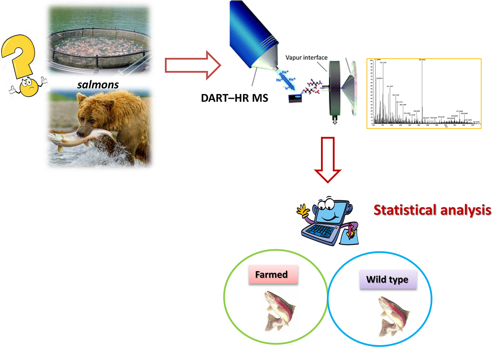
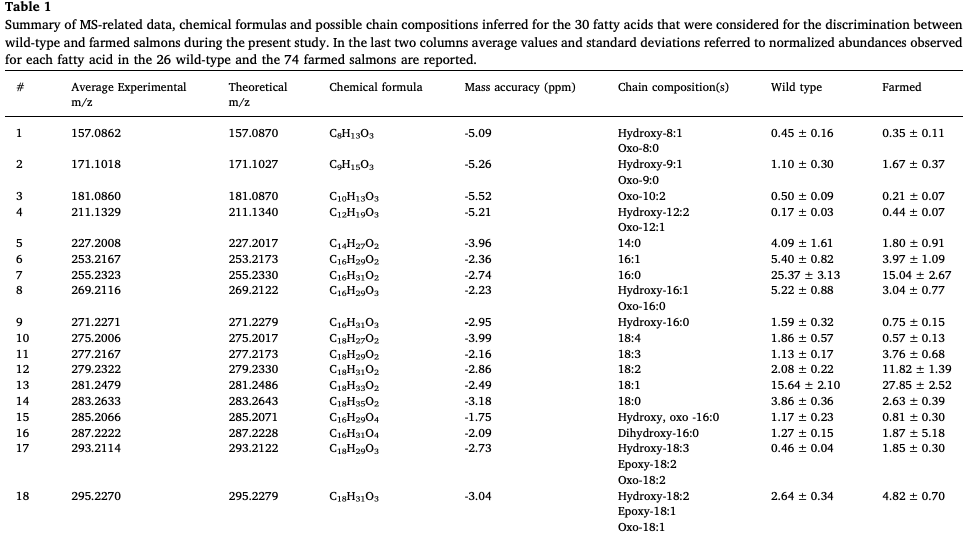
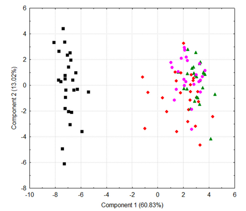
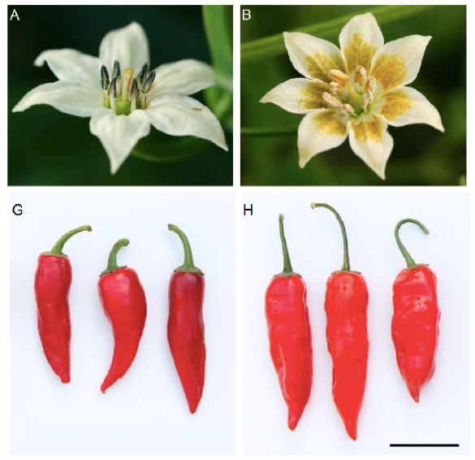
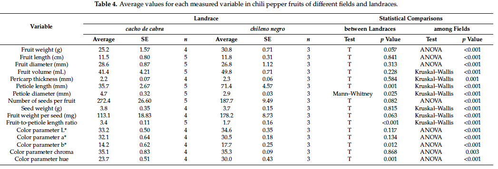
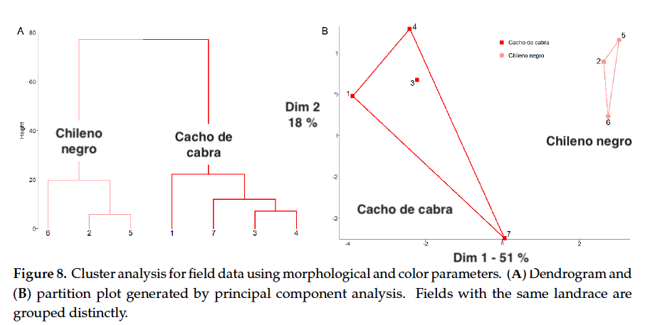
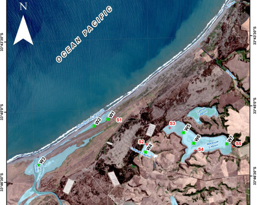
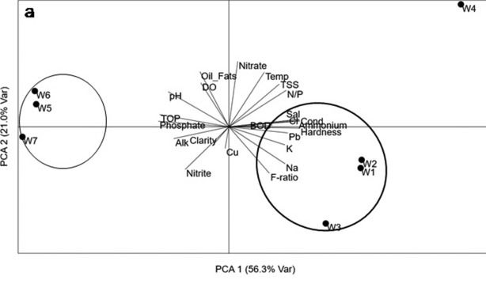
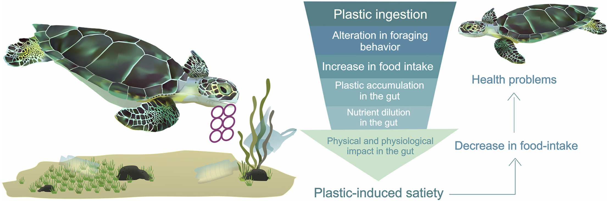

```{r setup, include=FALSE}
knitr::opts_chunk$set(echo = FALSE)
library(readxl)
library(ggplot2)
library(dplyr)
library(knitr)
library(vegan)
library(pander)

```

# PLAN DE LA CLASE

**1.- Introducción**
    
- ¿Qué son los análisis de componentes principales?
- Estudio de caso 1: Detectar fraude alimentario en salmón.
- Estudio de caso 2: Cacho de cabra v/s ají chileno negro.
- Estudio de caso 3: Contaminación ambiental Humedal Yali.
- Etapas para realizar un ACP.
- Varianza explicada.
- Graficas biplot.
- PERMANOVA
- Estudio de caso 4: Tortugas y contaminación por plástico.

**2). Práctica con R y Rstudio cloud.**

- Elaborar análisis de componentes principales con R.

# ANÁLISIS DE COMPONENTES PRINCIPALES

- **¿Qué son los análisis de componentes principales?**
a) Son una herramienta estadística multivariada que se utiliza para realizar análisis exploratorio de datos y para construir modelos predictivos.\
&nbsp;
b) Permite reducir la dimensionalidad de un set de datos con muchas variables respuesta, sin perder mucha información.\
&nbsp;
c) Permite encontrar patrones en un set de datos mediante el calculo de los “componentes principales”.   

# COMPONENTES PRINCIPALES

- **¿Qué son los componentes principales?**

a) Combinación lineal de las variables originales no correlacionadas entre si (perpendiculares / ortogonales).

```{r, echo=FALSE, out.width = '90%' }
knitr::include_graphics("CP.png")
```

# CASO 1: FRAUDE ALIMENTARIO SALMÓN.

- ¿Cómo distinguir filetes de salmón silvestre y de cultivo?
```{r, out.width='70%'}

```

[Fiorino et al. 2019](https://doi.org/10.1016/j.foodres.2018.10.013)

# ANÁLISIS UNIVARIADO ACIDOS GRASOS

```{r, out.width='100%'}

```

# PCA SALMON

\columnsbegin
\column{.7\textwidth}

```{r, out.width='100%'}

```

\column{.50\textwidth}

CP1 + CP2 explican 74 % de la varianza en ácidos grasos analizadas.\
&nbsp;     

CP1 separa grupos silvestre y de cultivo, pero CP2 no.\
&nbsp;    

El modelo puede ser usado para predecir fraude con base a los ácidos grasos.

\columnsend

# CASO 2: AJI CACHO DE CABRA.

\columnsbegin
\column{.7\textwidth}


```{r, out.width='100%'}

```

\column{.50\textwidth}

Comparación morfológica entre Cacho de cabra (izq.) v/s ají chileno negro (der.).\
&nbsp;    
[Muñoz-Concha et al. 2019](https://www.mdpi.com/2073-4395/10/10/1541)

\columnsend


# ANÁLISIS FUNCIONAL UNIVARIADO DE MORFOMETRÍA

```{r, out.width='110%'}

```


# ANÁLISIS ESTRUCTURAL MULTIVARIADO: CLUSTER Y PCA

- Note que los primeros 2 componentes principales explican un 69 % de la varianza explicada por las variables morfométricas analizadas.
```{r, out.width='100%'}

```

# CASO 3: CONTAMINACIÓN HUMEDAL YALI.

\columnsbegin
\column{.7\textwidth}

```{r, out.width='90%'}

```

\column{.50\textwidth}

Comparación calidad de agua lagunas Reserva el Yali.\
&nbsp;      
[Rivera et al. 2019](https://doi.org/10.1016/j.marpolbul.2019.06.054)

\columnsend

# ANÁLISIS MULTIVARIADO CALIDAD DE AGUA

```{r}
#a) Importa datos
Yali <-read_excel("Yali_PCA.xlsx",sheet=1)
Yali$Station <- as.factor(Yali$Station )
head(Yali[,4:10]) %>% pander(caption ="Organic and inorganic parameters measured in the water.")

```

# PCA YALI: GRAFICA BIPLOT

- Las gráficas biplot permiten observar simultáneamente la clasificación de muestras en grupos, la varianza explicada, la correlación entre variables y la contribución que ellas hacen a cada componente principal.

```{r, out.width='90%'}

```


# ETAPAS PARA REALIZAR UN ACP

1) Estandarizar datos: Media 0 y varianza 1.
.\
&nbsp;
2) Calcular matriz de distancia (euclideana) de valores estandarizados.\
&nbsp;
3) Calcular valores y vectores propios (Eigenvalue y Eigenvector) de la matriz estandarizada.\
&nbsp;
4) Interpretación varianza explicada y gráficas biplot.\
&nbsp;
5) Opcional: Prueba de hipótesis multivariada.

# MATRIZ DE DISTANCIA EUCLIDEANA
- Usar con variables cuantitativas continuas. \
&nbsp;
- Comparar efecto escala de las variables. \
&nbsp;
```{r}
bioenv <- read_excel("bioenv.xlsx", sheet = 1)
tabla <- bioenv %>% select(Sitio, Depth, Pollution, Temperature) %>% filter(Sitio %in% c("s29", "s30"))

kable(tabla)
```

  $s29-s30=\sqrt{(x_1-y_1)^2+(x_2-y_2)^2+(x_3-y_3)^2}$.\
&nbsp;
  
  $s29-s30=\sqrt{(51-99)^2+(6.0-1.9)^2+(3.0-2.9)^2}$.\
&nbsp;
  
  $s29-s30=\sqrt{(2304)+(18.81)+(0.01)}= 48.17$
  
# ESTANDARIZACIÓN

|  | **Depth**| **Pollution** | **Temperature** |
|:------:|:------:|:------:|:------:|
| **Mean** | 74,43 | 4,52 | 3,06 |
| **sd** | 15,61 | 2,14 | 0,28 |

Valor estandarizado : (valor original – mean) / sd  
Valor estandarizado s29 : (51 – 74,43) / 16,61 = -1,501

| **Sitio** | **Depth**| **Pollution** | **Temperature** |
|:------:|:------:|:------:|:------:|
| **s29** | -1,501 | 0,693 | -0,201 |
| **s30** | 1,573 | -1,222 | -0,557 |


# DISTANCIA EUCLIDEANA ESTANDARIZADA

| **Sitio** | **Depth**| **Pollution** | **Temperature** |
|:------:|:------:|:------:|:------:|
| **s29** | -1,501 | 0,693 | -0,201 |
| **s30** | 1,573 | -1,222 | -0,557 |

  $s29-s30=\sqrt{(-1,50-1,57)^2+(0,69-1,22)^2+(0,20-0,55)^2}$.\
&nbsp;
  
  Distancia estandarizada.  
  $s29-s30=\sqrt{(9,499)+(3,667)+(0,127)}= 3,639$.\
&nbsp;
  Distancia no estandarizada.  
  $s29-s30=\sqrt{(2304)+(18.81)+(0.01)}= 48.17$

# MATRIZ DE DISTANCIA ENTRE GRUPOS

```{r, echo=FALSE, out.width = '80%' }
knitr::include_graphics("Matriz.png")
```

# ANÁLISIS DE VARIANZA MULTIVARIANTE PERMUTACIONAL

- **¿Qué es un PERMANOVA?**   
a) Es una prueba estadística multivariante No paramétrica.\
&nbsp;

b) Determina, en términos simples, si existen o no diferencias entre grupos.\
&nbsp;

c) Usa la matriz de distancia y no los datos originales de las variables analizadas.\
&nbsp;

[Fuente: Anderson, 2001](https://doi.org/10.1111/j.1442-9993.2001.01070.pp.x)

# HIPÓTESIS PERMANOVA

- Hipótesis.
a) $H_0$= No existe diferencia entre los centroides de los grupos.
b) $H_1$= Al menos dos centroides son diferentes.


```{r, echo=FALSE, out.width = '70%' }
knitr::include_graphics("Manova.png")
```


# ESTUDIO DE CASO 4: TORTUGAS Y PLÁSTICO

- Comparación acumulación de plástico intestinal en tortugas marinas brasil.
```{r, out.width='100%'}

```

[Robson et al. 2020](https://doi.org/10.1016/j.envpol.2020.114918)


# DATOS CONTAMINACIÓN

```{r}
#a) Importa datos
Tortugas <-read_excel("Dataset_permanova.xlsx",sheet=2)
Tortugas$Area<-as.factor(Tortugas$Area)
Tortugas$Plastic<-as.factor(Tortugas$Plastic)
head(Tortugas[,1:7])%>% pander(caption ="Ingesta de plástico y dieta.")

```

# PERMANOVA DATOS CONTAMINACIÓN

- Sobre matriz de distancia estandarizada.
```{r}
# Crea nuevas variables
val_estandarizado <- Tortugas %>%
 select(Chlorophyta, Rhdophyta, Phaeophyceae, Land, Animal) %>%
 mutate(
Chlorophyta1 = (Chlorophyta - mean(Chlorophyta)) / sd(Chlorophyta),
Rhdophyta1 = (Rhdophyta - mean(Rhdophyta)) / sd(Rhdophyta),
Phaeophyceae1 = (Phaeophyceae - mean(Phaeophyceae)) / sd(Phaeophyceae),
Land1 = (Land - mean(Land)) / sd(Land),
Animal1 = (Animal - mean(Animal)) / sd(Animal))
dist_euclidea <- dist(val_estandarizado[6:10])
```


```{r, message=FALSE}
permanova <- adonis2(dist_euclidea ~ Area*Plastic , method = "bray", data=Tortugas, permutations=999)
permanova %>% pander()


```

# RESUMEN DE LA CLASE

- ¿Qué es un análisis de componentes principales?.\
&nbsp;
- Etapas para realizar un ACP.\
&nbsp;
- Varianza explicada.\
&nbsp;
- Graficas biplot.\
&nbsp;
- PERMANOVA.\
&nbsp;
- 4 estudios de caso: Fraude alimentario en salmón; Ají chileno; Contaminación Humedal; Tortugas y contaminación por plástico.